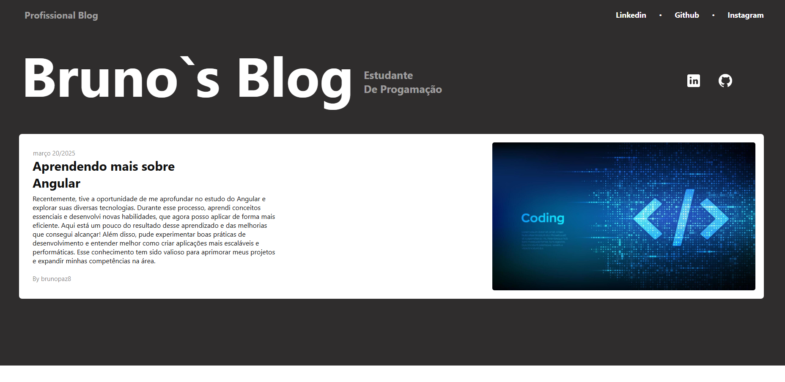
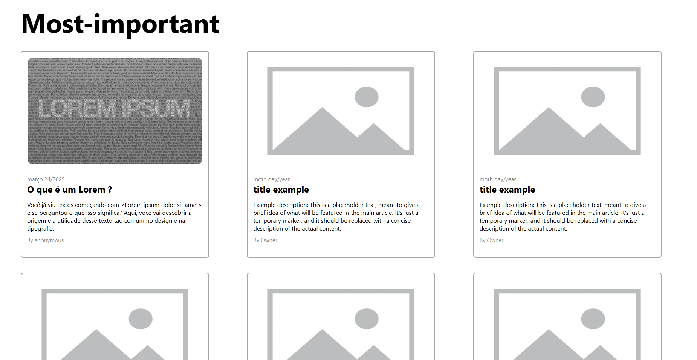
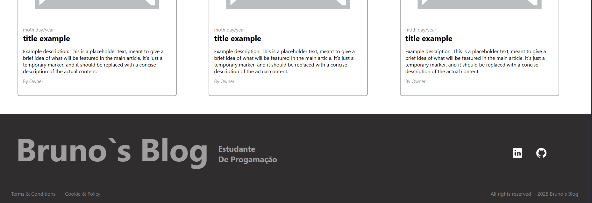
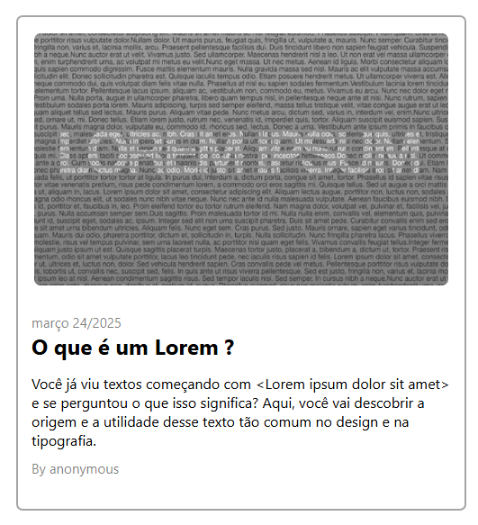
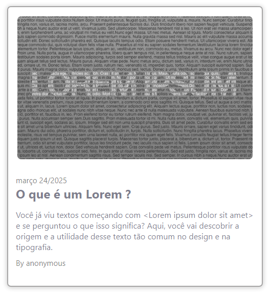

# 📚 Blog Pessoal com Angular 17

Este é um projeto de um **blog pessoal** desenvolvido com **Angular 17**. O objetivo foi praticar e aprimorar conhecimentos adquiridos sobre o framework, incluindo **componentização** e **estilização**.


## 🛠️ Tecnologias Utilizadas

- **[Angular CLI](https://github.com/angular/angular-cli)**** 19.2.4** – Framework para construção da interface
- **TypeScript** – Linguagem utilizada para o desenvolvimento
- **CSS** – Estilização dos componentes e layout


## 📸 Capturas de Tela

### 🟣 Parte Superior da Página


---

### 🟣 Parte Dos Botões


---

### 🟣 Parte Inferior


---

### 🟣 Animação do Botão
  

---

### 🟣 Dentro do Conteúdo


---

### 🟣 Vídeo do blog
[](https://youtu.be/-2n7A1shar8)


## 🚀 Como Executar o Projeto

Para rodar o projeto localmente, siga os passos abaixo:  

1️⃣ **Clone o repositório:**  

```sh
git clone https://github.com/brunopaz8/Blog
cd Blog
```

2️⃣ **Instale as dependências:**  

```sh
npm install
```

3️⃣ **Inicie o servidor de desenvolvimento:**  

```sh
ng serve
```

Agora, abra o navegador e acesse `http://localhost:4200/`. O aplicativo será recarregado automaticamente sempre que você modificar os arquivos.  

---


